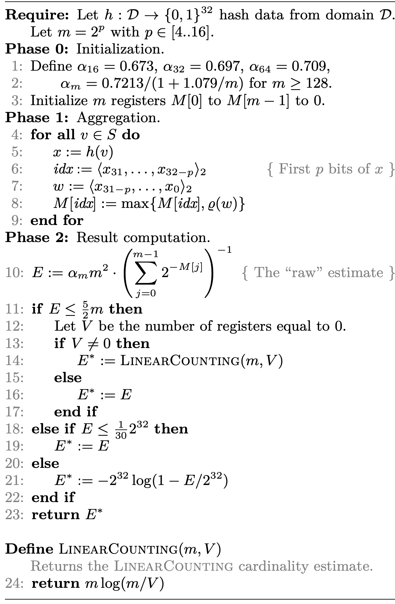

# java-hyper-log-log

An implementation of the classic **HyperLogLog** algorithm described in :
[https://algo.inria.fr/flajolet/Publications/FlFuGaMe07.pdf](https://algo.inria.fr/flajolet/Publications/FlFuGaMe07.pdf)
and [https://static.googleusercontent.com/media/research.google.com/zh-CN//pubs/archive/40671.pdf](https://static.googleusercontent.com/media/research.google.com/zh-CN//pubs/archive/40671.pdf)




#### Usage

```java
    Funnel<Long> funnel = new LongFunnel();
    ClassicHyperLogLog<Long> hyperLogLog = new ClassicHyperLogLog<>(funnel);
    putLongs(hyperLogLog, Long.MAX_VALUE >>> 2, 700000);
    byte[] bytes = hyperLogLog.toByteArray();
    ClassicHyperLogLog<Long> hyperLogLog1 = ClassicHyperLogLog.fromByteArray(bytes, funnel);
    assertEquals(hyperLogLog, hyperLogLog1);
```